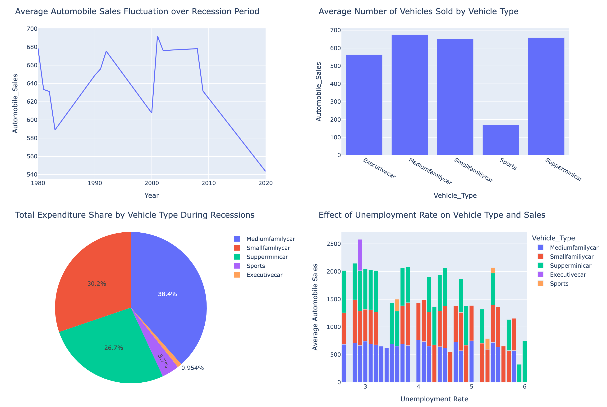

# Automobile Sales Analysis — Recession Impact & Interactive Dashboard

How do recessions change what cars people buy? This project analyses historical
automobile sales across recession and non-recession periods, then builds an
interactive dashboard to explore the result.

Two parts: a visual analysis in matplotlib, seaborn and Folium, and a Plotly Dash
application with linked callbacks.

---

## What the data shows

Sales collapse across every vehicle type during a recession — but not evenly.

| Vehicle type | Non-recession | Recession | Drop |
|---|---:|---:|---:|
| Medium family car | 2,982 | 675 | 77.4% |
| Small family car | 2,753 | 651 | 76.4% |
| **Supermini** | 2,495 | **659** | **73.6%** |
| Executive car | 2,686 | 564 | 79.0% |
| **Sports** | 2,911 | **170** | **94.1%** |

**Sports cars essentially disappear** — a 94% collapse, from 2,911 units to 170.
They are a discretionary luxury, and discretionary spending is the first thing to
go.

**Superminis hold up best**, with the smallest proportional decline. Cheap and
practical is what still sells when money is tight.

**Advertising follows the same logic.** The company spent **82.7%** of its ad
budget in non-recession periods against **17.3%** during downturns — and within
recessions, executive cars received the *smallest* share at 14.5%. Spending was
deliberately redirected away from the segment customers were already abandoning.

---

## Part 1 — Visual analysis

Nine analyses covering sales trends over time, the relationship between
advertising spend and sales, vehicle-type comparisons across economic periods,
GDP variation, seasonality, consumer confidence, vehicle price, and the effect of
unemployment on sales by vehicle type.

Tools: pandas · matplotlib · seaborn · Folium

## Part 2 — Interactive dashboard

A Plotly Dash application with two report modes selected from a dropdown:

**Recession Period Statistics** — average sales over the recession timeline,
sales by vehicle type, advertising share by vehicle type, and the effect of
unemployment rate on sales.

**Yearly Statistics** — a second dropdown becomes enabled, letting you pick a
year and see yearly average sales, monthly sales for that year, vehicle-type
averages, and advertising expenditure.

The year dropdown is disabled in recession mode via a callback — recession
statistics span multiple years, so selecting a single year would be meaningless.



---

## Running the dashboard

```bash
pip install dash pandas plotly
python dashboard/automobile_dash_app.py
# open http://127.0.0.1:8050
```

The dataset loads directly from the course URL, so no local data file is needed.

## Repository

```
notebooks/01_visual_analytics.ipynb   Part 1 — nine visual analyses
dashboard/automobile_dash_app.py      Part 2 — Plotly Dash application
images/                               Rendered dashboard reports
```

## Note on portability

The original lab ran in JupyterLite and used `pyodide.http` to fetch files, which
only works inside a browser-based notebook. Those calls are replaced with
`requests`, so the notebook runs on any normal Python install.
